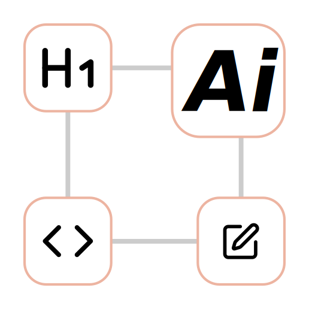
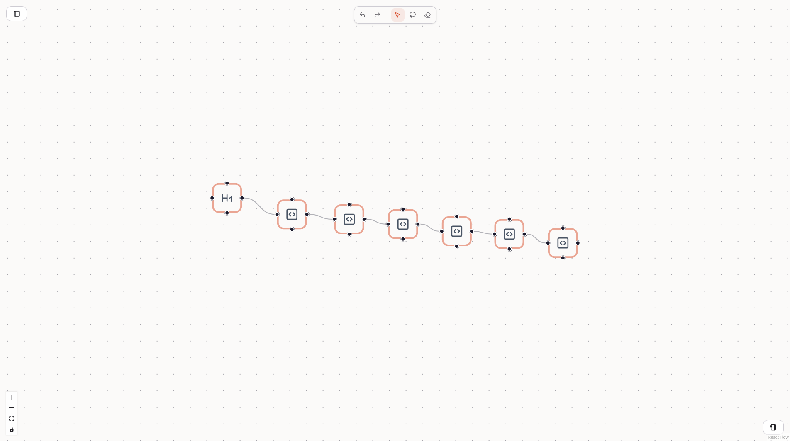

<div align="center">


# 🌊 Flow Editor: Unleash Your Ideas

🚀 **The Ultimate Node-Based Prompt & Thought Flow Creator**

[](https://nextjs.org/)
[](https://reactflow.dev/)
[](https://tailwindcss.com/)

</div>


---

## 🌟 What is Flow Editor?

Have you ever wanted to organize your thoughts, prompts, or data pipelines visually? **Flow Editor** is a cutting-edge, node-based interactive canvas built for creators, developers, and visionaries. 

It empowers you to map out complex relationships intuitively. Whether you're crafting multi-step AI prompts, designing conversation trees, or just brainstorming ideas, Flow Editor brings your concepts to life on an infinite canvas.

## ✨ Key Features

*   **🪄 Interactive Infinite Canvas:** Drag, drop, pan, and zoom seamlessly through your ideas using the power of React Flow.
*   **📝 Rich Text Nodes:** Not just simple labels. Double click any node to open a fully-featured **Rich Text Editor**. Bold, italicize, strike, and write code snippets on the fly!
*   **🔗 Smart Edges:** Connect your thoughts. Click on any edge to add labels and define the relationship between your nodes.
*   **🧹 Magic Eraser Mode:** Made a mistake? Switch to the Eraser tool and just swipe across the screen to delete nodes and edges instantly with a beautiful visual trail.
*   **🎯 Master Selection (Lasso Tool):** Select multiple elements at once to copy and paste them lightning fast with standard keyboard shortcuts (`Ctrl+C` / `Ctrl+V`).
*   **💾 Auto-Save:** Never lose a brilliant idea. Your flow is automatically saved to your local storage in real-time.
*   **⏮️ Time Travel (Undo/Redo):** Complete freedom to experiment. Use `Ctrl+Z` to undo and `Ctrl+Y` to redo your actions effortlessly.
*   **📊 Markdown Export:** Ready to share? Hit the View Result button to instantly compile your interconnected nodes into a clean **Markdown** document, organized chronologically.

## 🚀 Getting Started

Dive into the flow in seconds. 

1. **Clone & Install:**
   ```bash
   npm install
   ```

2. **Run the Development Server:**
   ```bash
   npm run dev
   ```

3. **Open in Browser:**
   Navigate to [http://localhost:3000](http://localhost:3000) and start creating!


## 💡 Pro Tips for Power Users

- Use the **Lasso Tool** to grab entire branches of your flow and duplicate them with `Ctrl+C` and `Ctrl+V`.
- Switch to the **Eraser Tool** (pink icon) for extremely satisfying bulk deletions.
- Open the **Result** panel in the bottom right to see how your visual graph translates into a linear markdown document. 

---

<div align="center">
<i>Built with passion to make mapping your mind a beautiful experience.</i>
</div>
